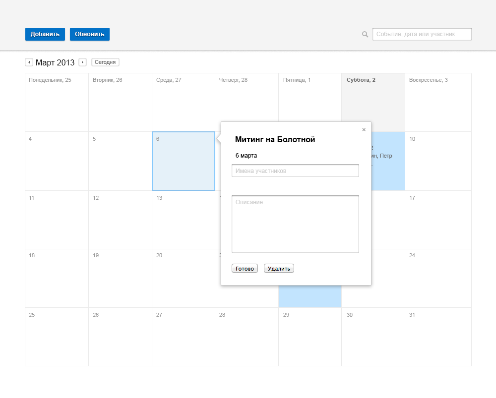
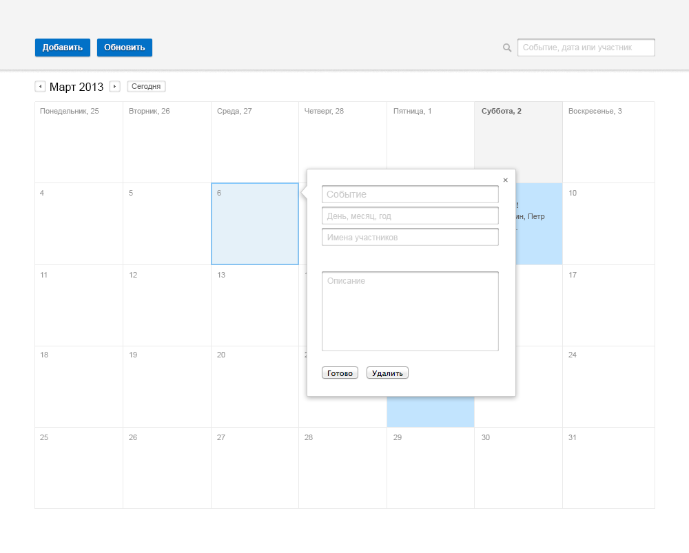

The assigment for entering HeadHunter school
==================

The calendar page should be made according mockups below:

### Requirements

 * Maximum compliance with mockups.
 * Current month should be shown after openning calendar.
 * Highlight selected day by click.
 * Support by modern browsers (IE 9+, Chrome, Firefox, Safari, Opera).

### Additional requirements:

 * Any extra calendar features (add/edit events, month switching, search).
 * Save calendar to localStorage.
 * Using native Javascript.

### Examples of extra logic for the calendar:

Form for quick adding a new event:

When the event has been added the popup with details should be opened:

The participants has been added:

Add an event by click on the calendar cell:

Search:

