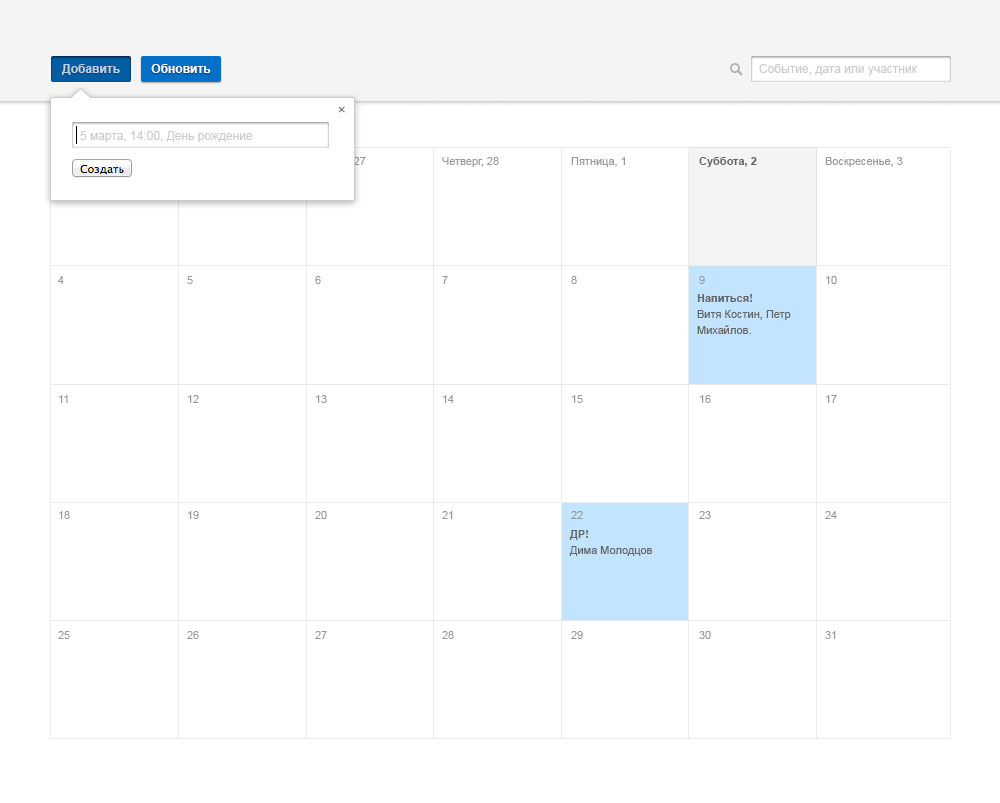
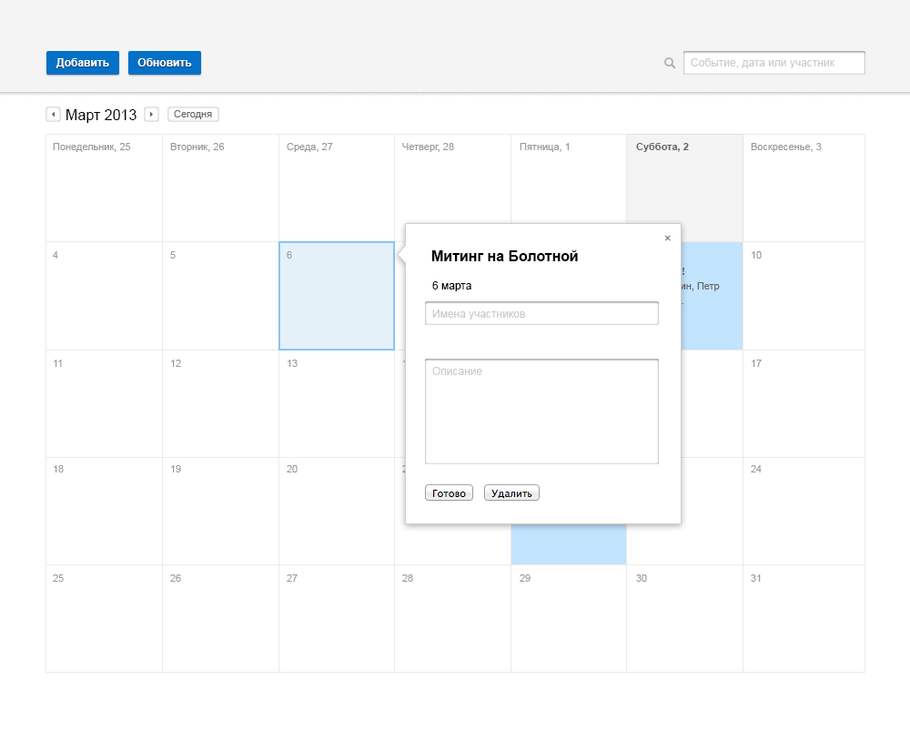
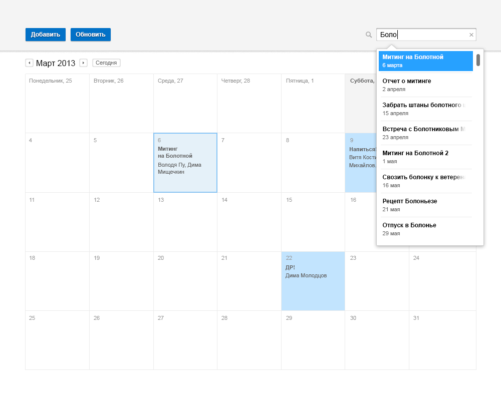

Задание на поступление в школу HH
==================

Необходимо сверстать страницу календаря в соотвествии с макетом ниже:

### Требования

 * Максимальное соответствие верстки макету
 * При открытии календарь должен показывать текущий месяц
 * Подсветка выбранного дня в календаре (при клике)
 * Поддержка современными браузерами (IE 9+, Chrome, Firefox, Safari, Opera)

### Плюсами будут:

 * Любая дополнительная логика работы календаря (добавление/редактирование событий, переход по месяцам, поиск)
 * Сохранение календаря в localStorage
 * Использование нативного JavaScript

### Примеры дополнительной логики работы:

Быстрое добавление события:

После быстрого добавления открываем попап с подробностями:

Добавили участников:

Добавление событя при клике на квадрат даты:

Поиск:

