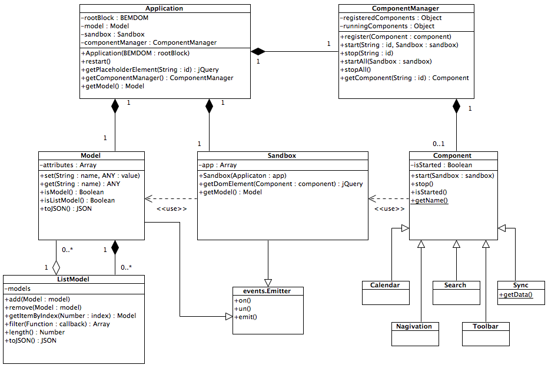

# UML Diagrams
All diagrams has been drawn in Visual Paradigm for UML CE. It is a powerful tool for creating diagrams and it is [free](http://www.visual-paradigm.com/download/vpuml.jsp?edition=ce) (for non-comercial use of course).

## Class diagrams

## Sequence diagrams
### Application start

